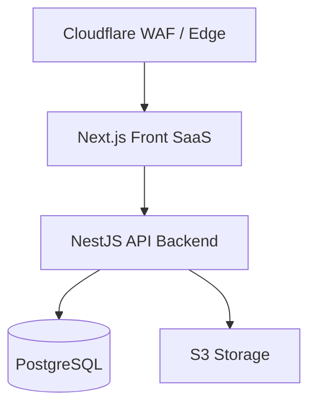
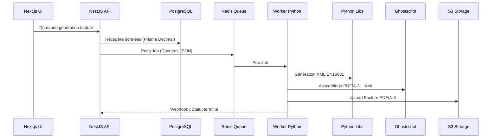

# Architecture Simple

## Flux d'information

## Règle Absolue (Dogme Architectonique)
- **Le Frontend (Next.js)** : Ne contient **AUCUNE** logique fiscale. Il gère uniquement le rendu, l'UX et la saisie des données.
- **Le Backend (NestJS)** : Gère à 100% :
  - Les calculs de TVA (sans erreur d'arrondi).
  - La conformité stricte.
  - La génération Factur-X / EN16931 (XML UBL/CII).
  - Les permissions (RBAC).
  - L'audit trail.
# Stratégie Documentaire : PDF/A-3 & Factur-X

## Philosophie : Le "Bon" Microservice
Contrairement au syndrome de la startup (qui divise tout en `user-service`, `email-service`, etc.), nous adoptons une approche monolithique pour l'API métier, avec **un seul microservice ultra-spécifique** dédié à une tâche complexe : la génération de documents légaux.

## Architecture de Génération

## Choix Technologique : Python > Node.js
Pour ce périmètre précis, Python est largement supérieur à l'écosystème JS :
- **PDF/A-3** : Les librairies Python couplées à Ghostscript sont excellentes et standards.
- **XML Complexe** : Manipulation native et stricte via `lxml`.
- **Factur-X** : Écosystème open-source plus mature (ex: outils de l'état français ou initiatives européennes souvent basés sur Python/Java).
- **Signature PDF** : Très bon support natif.
